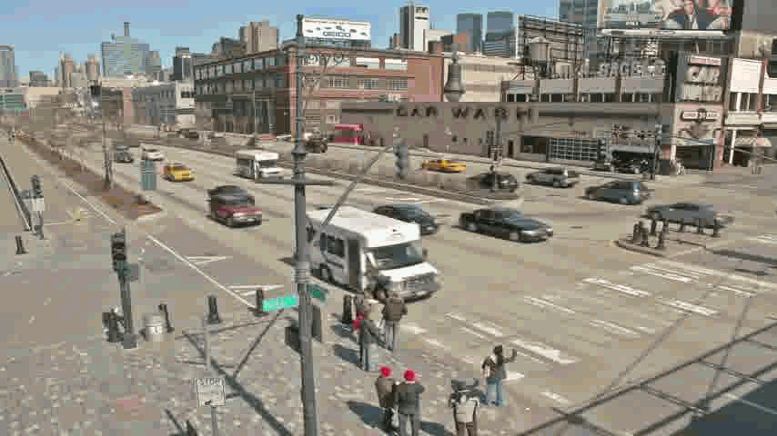
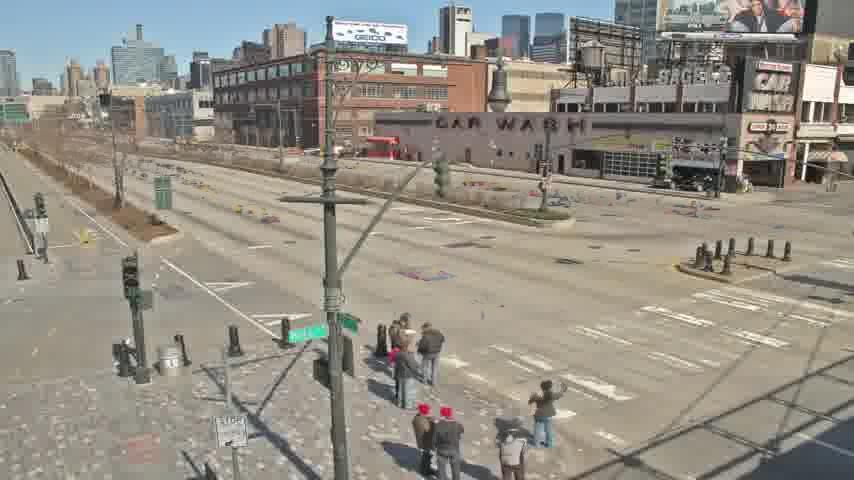

# Image Processoring
These are utilities for image processoring, feel free to use these codes. Explanation of each one below

# Reverse
The file <a href="https://github.com/Arlequiin/image_processoring/blob/main/reverse.py">reverse.py</a> contains a code that can open a picture, reverse it and save it as `output.jpg`.
 __Example below__ 

# Shifting

The file <a href="https://github.com/Arlequiin/image_processoring/blob/main/shift.py">shift.py</a> contains a code that can open a picture, shift it to the choosen value and save it as `output.jpg`.
- Edit the shift value :
Go to <a href="https://github.com/Arlequiin/image_processoring/blob/main/shift.py#L12">this line</a> and change the value (default : 100), the amount is is pixels.
 __Example below__ 

# Greyscale

The file <a href="https://github.com/Arlequiin/image_processoring/blob/main/gresycale.py">greyscale.py</a> contains a code that can open a picture, make it greyscale and save it as `output.jpg`.
 __Example below__ 

# Remove moving elements from gif

The file <a href="https://github.com/Arlequiin/image_processoring/blob/main/main.py">main.py</a> contains a code that can open multiple pictures, remove the moving elements between the pictures and save the output as `output.jpg`.
 __Example below__ 
- Original : 

 - Output : 

